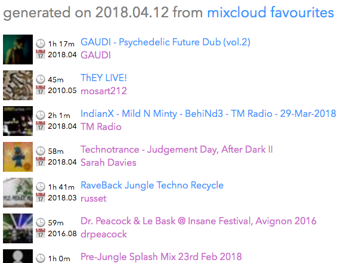

# Mixcloud Favourite Script
I love the music on [Mixcloud](https://www.mixcloud.com/). I listen to it most every day. One usability issue that I've always been annoyed by is the inability to see all of my favourites (by now almost 500) on one page and to be able to easily search through them.

Fortunately Mixcloud also has a very simple JSON API which even a web-adverse programmer such as myself can use. So I made a simple python script to generate a static HTML page with all of my favourites on it. Maybe it will be useful to you?

## Dependencies
```
$ pip install argparse
$ pip install jinja2
$ pip install requests
```

## Usage
```
$ python3 mixcloud.py <username>
```

## Result


## License
This code is released under the [ISC License](https://opensource.org/licenses/ISC).
